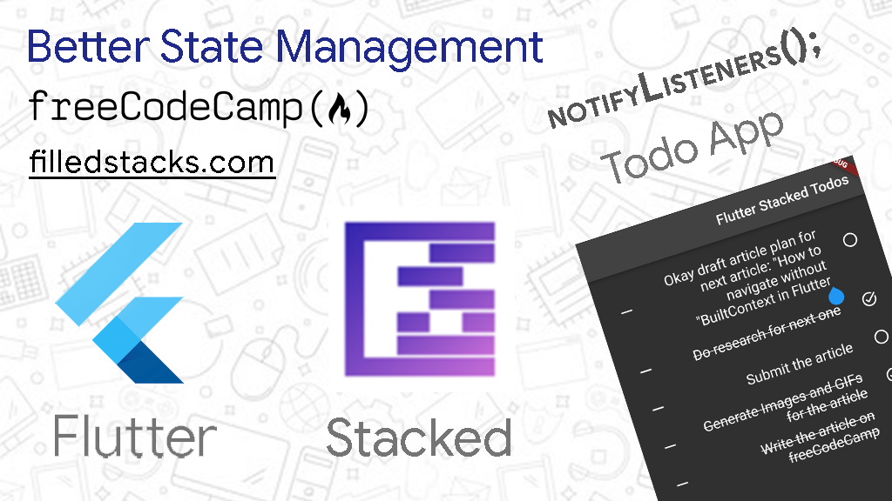

# Flutter Todo App with Stacked Architecture

A simple one-screen dark-mode Todo App built with [Flutter](https://flutter.dev/). Specifically, it was built with the [Stacked architecture](https://pub.dev/packages/stacked).

This app displays Todos one after the other. Each Todo has a "checkable circle" to toggle its completed status, its content, and a dash icon to remove it.

[Read the article on how to build it on freeCodeCamp at  https://www.freecodecamp.org/news/flutter-stacked-architecture-todo-app/](https://www.freecodecamp.org/news/flutter-stacked-architecture-todo-app/)
